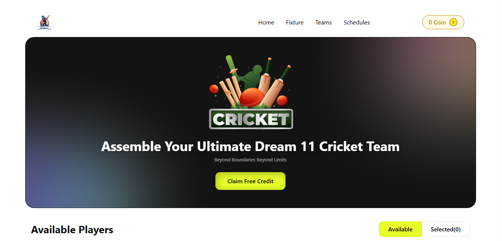

# 🚀 BPL-DREAM 11

[](https://b10-assignment-7.vercel.app/)


This repository contains the source code for "BPL-DREAM 11," a responsive cricket team selection platform built with React and Vite. This project was developed as part of the Programming Hero Web Development Course, showcasing skills in modern front-end technologies.

## 🌐 Live Preview
🔗 **[https://b10-assignment-7.vercel.app/](https://b10-assignment-7.vercel.app/)**

## 🖼️ Screenshot
A preview of the deployed project:


## 📌 About This Project
BPL-DREAM 11 is a single-page web application that simulates a cricket team selection experience similar to fantasy sports platforms. Users can browse available cricket players, manage their coin balance, and build their dream team by selecting players within budget constraints. The platform features a clean, user-friendly interface with player cards displaying ratings, roles, and pricing. The project is fully responsive and designed with a mobile-first approach to ensure a seamless experience on all devices.

## 🎯 Key Features
- **Player Selection System:** Browse and select cricket players with coin-based budget management.
- **Dynamic Team Building:** Add/remove players from your team with real-time coin balance updates.
- **Interactive Player Cards:** View player details including ratings, roles, and pricing.
- **Dual View Mode:** Switch between available players and selected team views.
- **Local Storage Integration:** Persistent coin balance across browser sessions.
- **Responsive Design:** Fully responsive layout optimized for mobile, tablet, and desktop screens.
- **Component-Based Architecture:** Built with React for a modular and maintainable codebase.

## 🛠️ Technologies Used
| Technology | Purpose |
|------------|---------|
| **React** | For building the user interface with a component-based architecture. |
| **Vite** | For a fast and modern development environment and build tool. |
| **Tailwind CSS** | For utility-first styling and rapid UI development. |
| **JavaScript** | For application logic and interactivity. |
| **ESLint** | For code linting and maintaining code quality. |
| **PostCSS** | For processing CSS with Tailwind CSS. |
| **Vercel** | For continuous deployment and hosting. |

## 📂 Project Structure
Here is an overview of the file structure:
```
B10-Assignment-7/
├── public/
│   └── vite.svg
├── src/
│   ├── assets/
│   │   ├── banner-main.png
│   │   ├── bg-shadow.png
│   │   ├── logo-footer.png
│   │   ├── logo.png
│   │   └── site-Screenshot.png
│   ├── components/
│   │   ├── FancyAlert.jsx
│   │   ├── Footer.jsx
│   │   ├── Hero.jsx
│   │   ├── Navbar.jsx
│   │   ├── Newsletter.jsx
│   │   └── Players.jsx
│   ├── App.css
│   ├── App.jsx
│   ├── index.css
│   └── main.jsx
├── .gitignore
├── eslint.config.js
├── index.html
├── package.json
├── postcss.config.js
├── tailwind.config.js
├── vite.config.js
└── README.md
```

## 🚀 How To Get Started
To explore this project on your local machine, follow these steps:

1. **Clone the repository:**
   ```bash
   git clone https://github.com/alamin247khan/B10-Assignment-7.git
   ```
2. **Navigate to the project directory:**
   ```bash
   cd B10-Assignment-7
   ```
3. **Install dependencies:**
   ```bash
   npm install
   ```
4. **Run the development server:**
    ```bash
    npm run dev
    ```
5. **Open your browser** and visit `http://localhost:5173` (or the address shown in the terminal).

## 🙏 Acknowledgements
A special thank you to the entire [Programming Hero](https://web.programming-hero.com/) team for their guidance and support throughout this learning journey.

